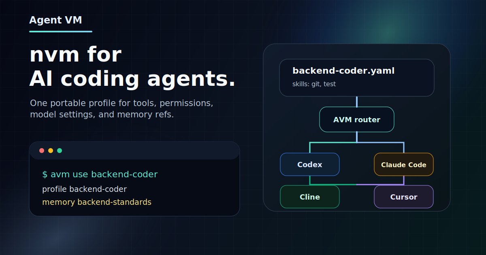

<p align="center">
  
</p>

<h1 align="center">Agent VM</h1>

<p align="center">
  <strong>Manage AI agent profiles across runtimes.</strong>
  <br>
  Create reusable agent configurations and apply them to Codex, Claude Code, OpenCode, Cline, or Cursor.
</p>

<p align="center">
  <a href="https://github.com/xz1220/Agent-VM/actions/workflows/ci.yml"></a>
  
  
  
</p>

<p align="center">
  English | <a href="README.zh-CN.md">简体中文</a>
</p>

Agent VM, or `avm`, is a local manager for AI coding agent configuration. It gives
users a small set of durable objects:

- **Agent**: a reusable agent profile with instructions, skills, MCP servers,
  and runtime configuration.
- **Environment**: a future lightweight working context that lists which Agents
  are available. The current product path uses one default Environment.
- **Package**: a distributable bundle that can install agents and their
  referenced capabilities.
- **Runtime**: the target tool where an agent becomes active, such as Codex,
  Claude Code, OpenCode, Cline, or Cursor.

In daily use, create or install an Agent, run or switch to that Agent, then
start Codex, Claude Code, OpenCode, Cline, or Cursor. Skills are configured
while creating or editing an Agent; AVM handles runtime detection, syncing, and
managed activation for you.

## Daily Path

```bash
avm create
avm use backend-coder
codex
```

The intended path is simple:

1. Install and initialize AVM.
2. Create an Agent profile with the current preview wizard.
3. Run an Agent, or use an Agent in the current shell.
4. Start your runtime when using shell activation.

```text
Package / existing Agent
  -> create Agent
    -> run or use Agent
      -> runtime-specific managed config
        -> Codex / Claude Code / OpenCode / Cline / Cursor
```

## User Modules

### 1. Install, Initialize, And Uninstall

This module owns AVM's lifecycle on the machine.

Current preview:

```bash
curl -fsSL https://raw.githubusercontent.com/xz1220/Agent-VM/main/scripts/install.sh | sh
avm init
avm shell init zsh
```

The installer puts `avm` in `$HOME/.local/bin` by default, installs shell
integration into your shell rc file, and initializes `~/.avm` unless
`AVM_SKIP_INIT=1` is set.

Product target:

```bash
avm init
avm doctor
avm uninstall
avm shell install
avm shell uninstall
```

### 2. Agent Configuration

Agent configuration is the primary product surface. An Agent owns its skills,
MCP servers, instructions, and runtime configuration.

Current preview:

```bash
avm create
avm create backend-coder
avm create --from default --name api-coder

avm agent create backend-coder --runtime codex --skills git,test
avm agent clone backend-coder --name backend-reviewer
avm agent edit backend-reviewer
avm agent rename backend-reviewer reviewer --update-refs
avm agent delete reviewer --force
avm agent list
avm agent show backend-coder
avm agent show backend-coder --runtime codex
```

Agent CRUD surface:

```bash
avm agent create
avm agent list
avm agent show <name>
avm agent edit <name>
avm agent delete <name>
avm agent clone <name> --name <new-name>
avm agent rename <old-name> <new-name>
```

`avm create` remains the first-run wizard and shortcut entry. It should create an
Agent from one of these sources:

- a blank/default Agent
- a built-in or installed Package
- an existing Agent

### 3. Default Environment And Future Environments

Environment management is not a core user module in the current product path.
AVM only needs one default Environment for now.

If Environment becomes a first-class feature later, it should stay a small layer:
a named working context that lists which Agents are available. It should not map
runtimes to Agents, because each Agent already owns its runtime configuration.

Current preview builds may still expose `avm env` commands. Treat them as
experimental compatibility surface, not the daily path.

### 4. Use And Activation

This is the daily switching surface.

```bash
avm use backend-coder
avm status
avm deactivate
```

With shell integration installed, `avm use` updates the current shell so runtime
environment variables such as `CODEX_HOME`, `CLAUDE_CONFIG_DIR`, and
`OPENCODE_CONFIG_DIR` point to AVM-managed, agent-scoped runtime homes.

OpenCode needs process-scoped data/state variables for full isolation. Use:

```bash
avm run opencode
```

`avm sync` exists in the preview, but it should be treated as an advanced repair
or debugging command rather than a primary user module.

### 5. Packages

Packages are for distribution and reuse. Users install packages to get Agents
and referenced capabilities; they do not usually "use" a package directly.
Packages do not install, export, or carry Environment metadata.

Current preview:

```bash
avm package list
avm package show reviewer
avm package inspect backend-coder.avm.zip
avm export backend-coder --output backend-coder.avm.zip
avm install backend-coder.avm.zip
```

Product target:

```bash
avm package list
avm package show <package>
avm package install <package-or-file>
avm package uninstall <package>
avm package export <agent>
avm package inspect <file.avm.zip>
```

## Runtime Support

AVM renders the selected Agent into runtime-specific managed files.

| Runtime | Status | Notes |
| --- | --- | --- |
| Codex | Supported | Native profile/model/reasoning mapping where available |
| Claude Code | Supported | Agent frontmatter and MCP/skills mapping |
| OpenCode | Supported | Config, agent, skills, and MCP mapping |
| Cline | Compatibility | Mostly rendered as rules/MCP settings |
| Cursor | Compatibility | Conservative rules/MCP proof of concept |

Adapters must report each field as `native`, `rendered_as_instructions`,
`ignored`, or `unsupported`. AVM should not pretend every runtime supports the
same feature set.

## Current Preview Gaps

The current CLI already proves the local activation model, but the product
surface is not finished.

| Area | Available today | Gap |
| --- | --- | --- |
| Agent | `create`, `list`, `show`, `edit`, `delete`, `rename`, `clone` | richer first-run/package-backed create flow and interactive polish |
| Environment | partial `env` commands | default-only product path; future semantics should be an Agent set, not runtime mapping |
| Install lifecycle | installer, `init`, `shell init` | missing first-class doctor/uninstall commands |
| Package | list/show/inspect/export/install | install/export naming still split across commands |
| Skills | `skill list` | should be surfaced primarily inside Agent create/edit |
| Sync | `sync` | should mostly disappear behind `use`/activation |

## Safety Model

AVM is conservative by default:

- installer initialization and `avm init` write under `~/.avm`.
- Agent config should become an explicit CRUD resource, not implicit overwrites.
- Runtime-native files are written only through adapter-declared managed paths.
- Unsupported runtime fields are reported, not silently dropped.
- Secrets should be referenced through environment variables, not exported as
  plaintext profile data.

## Development

```bash
make test
make vet
make fmt
make build
```

The main package is `cmd/avm`. Core packages live under `internal/config`,
`internal/adapter`, `internal/sync`, `internal/runtime`, `internal/state`, and
`internal/packageio`.

Useful project docs:

- [Product requirements](docs/product/prd.md)
- [Technical design](docs/design/tech-design.md)
- [Architecture](docs/engineering/architecture.md)
- [Data model](docs/engineering/data-model.md)
- [Implementation plan](docs/engineering/implementation-plan.md)
- [Acceptance criteria](docs/engineering/acceptance.md)

## License

No open-source license has been selected yet. Until a license is added, the code
is source-available but not broadly reusable under an open-source license.
