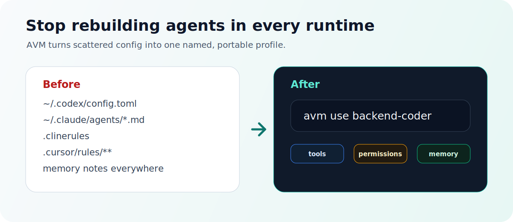

<p align="center">
  
</p>

<h1 align="center">Agent VM</h1>

<p align="center">
  <strong>nvm for AI coding agents.</strong>
  <br>
  Um perfil portátil para ferramentas, permissões, configuração de modelo e memory refs.
</p>

<p align="center">
  <a href="https://github.com/xz1220/Agent-VM/actions/workflows/ci.yml"></a>
  
  
  
</p>

<p align="center">
  <a href="README.md">English</a> | <a href="README.zh-CN.md">简体中文</a> | <a href="README.ja.md">日本語</a> | <a href="README.ko.md">한국어</a> | <a href="README.es.md">Español</a> | Português | <a href="README.fr.md">Français</a>
</p>

Agent VM, ou `avm`, é um control plane local para perfis de agentes de IA para programação. Você define um agente uma vez e renderiza esse perfil para runtimes como Codex, Claude Code, Cline e Cursor.

A aposta: desenvolvedores não vão padronizar em um único coding agent. Falta um objeto portátil que diga quem é o agente, o que ele pode usar, quais modelos prefere, quais permissões tem e qual memória de longo prazo deve carregar.

<p align="center">
  
</p>

## O movimento

```bash
avm use backend-coder
```

Esse comando deve virar o hábito para alternar seu ambiente local de AI coding. Em vez de reconstruir o mesmo papel em prompt files, MCP config, rules directories e notas de memória, o AVM torna o Agent Profile a source of truth.

```text
backend-coder.yaml
  -> avm use backend-coder
    -> Codex profile
    -> Claude Code agent
    -> Cline rules
    -> Cursor rules
```

## Diferenças

| Abordagem | O que gerencia | O que falta |
| --- | --- | --- |
| Dotfiles | Arquivos e symlinks | Sem objeto Agent nem mapping status |
| MCP config managers | Configuração de tool servers | Geralmente sem role, memory, model e permissions |
| Runtime-native profiles | Um ecossistema | Difícil portar para outros runtimes |
| Agent VM | Agent Profile + capabilities + memory refs + adapters | Projeto inicial; concrete adapters em construção |

Cada adapter deve reportar o mapeamento dos campos como `native`, `rendered_as_instructions`, `ignored` ou `unsupported`.

## O que um Profile carrega

| Camada | Exemplo |
| --- | --- |
| Identity | `backend-coder`, `pr-reviewer`, `incident-runner` |
| Runtime | `codex`, `claude-code`, `cline`, `cursor` |
| Model run | model name, reasoning effort, verbosity |
| Capabilities | skills, commands, hooks, MCP servers, toolsets |
| Permissions | approval mode, sandbox intent, allow/deny policy |
| Memory refs | project architecture, team conventions, user preferences |

## Recipe

```yaml
name: backend-coder
runtime:
  preferred: codex
model_run:
  model: gpt-5.4
  reasoning_effort: high
capabilities:
  skills: [git, test, migration]
  mcps: [github, postgres-readonly]
permissions:
  approval: on-risky-actions
  sandbox: workspace-write
memory_refs:
  - id: backend-standards
    scope: project
    mode: read
```

## Status

Este repositório é uma early preview. O core model e os primeiros comandos da CLI já existem; o próximo marco é profile activation.

Funciona hoje:

- `avm init`
- `avm agent create/list/show`
- `avm env create`
- `avm memory import --from <file> --dry-run`
- config validation and resolution tests
- adapter contract, fake adapter, and Phase 1 fixtures

Em progresso:

- `avm use <profile-or-env>`
- `avm status`
- `avm deactivate`
- concrete Codex and Claude Code adapter writes
- release packaging

## Quickstart

Pré-requisitos:

- Go 1.22+

```bash
git clone https://github.com/xz1220/Agent-VM.git
cd Agent-VM

go run ./cmd/avm --help
go run ./cmd/avm init
```

```bash
go run ./cmd/avm agent create backend-coder \
  --runtime codex \
  --model gpt-5.4 \
  --reasoning high \
  --skills git,test \
  --mcps github \
  --memory backend-standards:project
```

## Target CLI Experience

```bash
avm init
avm agent create backend-coder --runtime codex --skills git,test
avm use backend-coder
avm status
```

## Safety Model

- `avm init` escreve apenas em `~/.avm`.
- Runtime-native memory só é importada por comandos explícitos.
- `memory import` suporta dry-run antes de escrever.
- Adapters só controlam managed paths declarados.
- Campos não suportados são reportados, não descartados silenciosamente.
- Secrets devem ser referenciados por variáveis de ambiente, não exportados em plaintext.

## Docs

- [Design system](DESIGN.md)
- [Product requirements](docs/product/prd.md)
- [Technical design](docs/design/tech-design.md)
- [Roadmap](ROADMAP.md)

## License

No open-source license has been selected yet. Until a license is added, the code is source-available but not broadly reusable under an open-source license.
